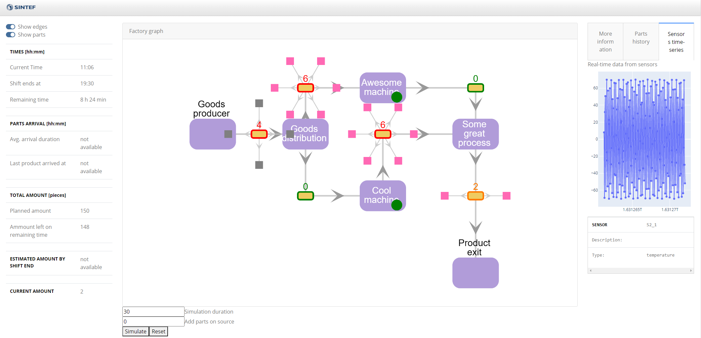

# SINDIT - SINTEF Digital Twin

## Description


## **Requirements**

### System:

1. Docker compose

If you are using windows see [here](https://docs.microsoft.com/en-gb/windows/wsl/install-win10#step-4---download-the-linux-kernel-update-package)

### Local deployment of example factory:

2. Build the Docker containers

	```sh
	docker compose build
	```

3. Start up the Docker containers

    ```sh
	docker compose up
	```
	
4. The example dash board can be reached on [http://localhost:8050/](http://localhost:8050/)




To start the simulation to see the parts (pink boxes) moving through the factory graph enter the simulation duration and number of additional parts to be added to the entry buffer and press 'Simulate'. With 'Reset' the original state of the factory graph can be restored.


## References

1. [simpy](https://pypi.org/project/simpy/)

## Blame & Contact

- Maryna Waszak [<maryna.waszak@sintef.no>](mailto:maryna.waszak@sintef.no)
