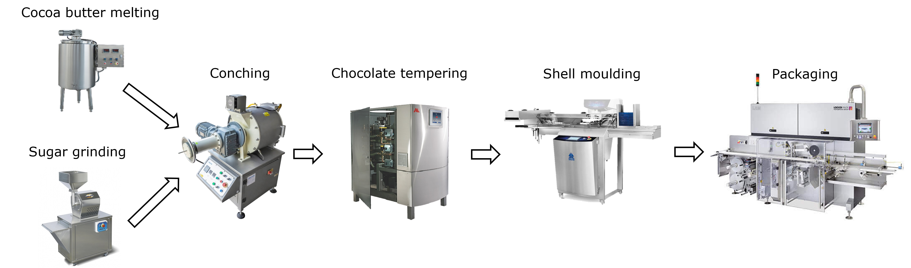
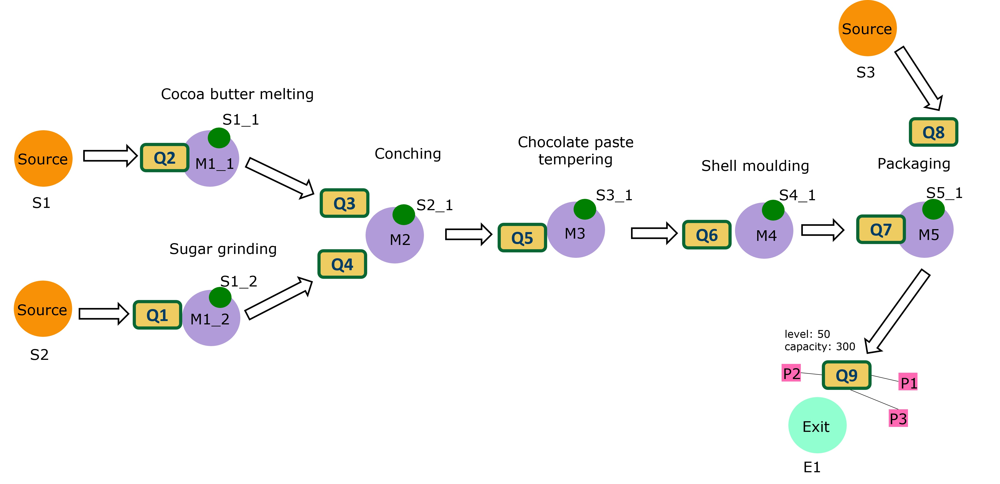
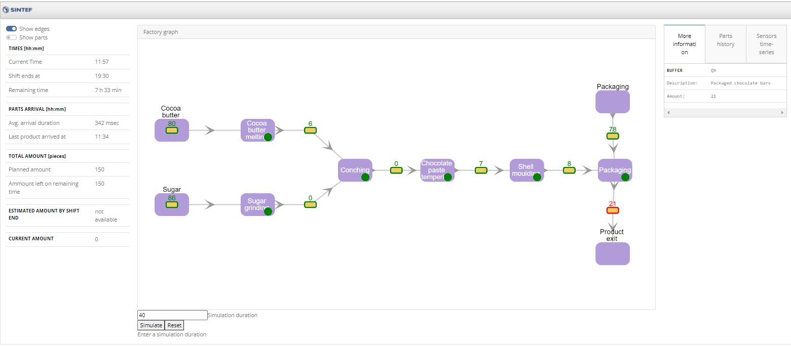

# SINDIT - SINTEF Digital Twin

## Description
This work has bee presented at the [ICSA22 conference](https://icsa-conferences.org/2022/conference-tracks/new-and-emerging-ideas/)
Link to the paper: [link](https://ieeexplore.ieee.org/document/9779654)

[Watch the presentation here](https://www.youtube.com/watch?v=ExHNP6527d8&list=PLmMTZhDUcVmuFcJG9tbxR6AAWcOl2Jej3&index=29&t=2s)

*Cite the work:*

```
@inproceedings{waszak2022ICSA,
  title={Let the Asset Decide: Digital Twins with Knowledge Graphs},
  author={Waszak, Maryna and Lam, An Ngoc and Hoffmann, Volker and Elvesæter, Brian and Mogos, Maria Flavia and Roman, Dumitru},
  booktitle={IEEE 19th International Conference on Software Architecture Companion (ICSA-C)},
  year={2022}
}
```


### Chocolate Production Process

Here, we have several steps before the chocolate bars can be moulded and finally wrapped. The process starts with conching ground sugar with melted cocoa butter. Through tempering of the chocolate it obtains the sheen and crisp properties that we all know from chocolate bars.




### Modelling the Chocolate Factory

This is a simplified digital model of the chocolate factory. M1-M5 are machines with sensors S1-S5. Between the machines the ingredients are stored in queues Q1-Q9. At the last queue Q9 the packaged chocolate bars are modelled as pink squares P1-P3.



## **Requirements**

### System:

1. Docker compose

If you are using windows see [here](https://docs.microsoft.com/en-gb/windows/wsl/install-win10#step-4---download-the-linux-kernel-update-package)

### Local deployment of example factory:

2. Build the Docker containers

	```sh
	docker compose build
	```

3. Start up the Docker containers

    ```sh
	docker compose up
	```
	
4. The example dash board of a chocolate factory can be reached at [http://localhost:8050/](http://localhost:8050/)




To start the simulation enter the simulation duration and press 'Simulate'. With 'Reset' the original state of the factory graph can be restored.


## References

1. [simpy](https://pypi.org/project/simpy/)

## Blame & Contact

- Maryna Waszak [<maryna.waszak@sintef.no>](mailto:maryna.waszak@sintef.no)
